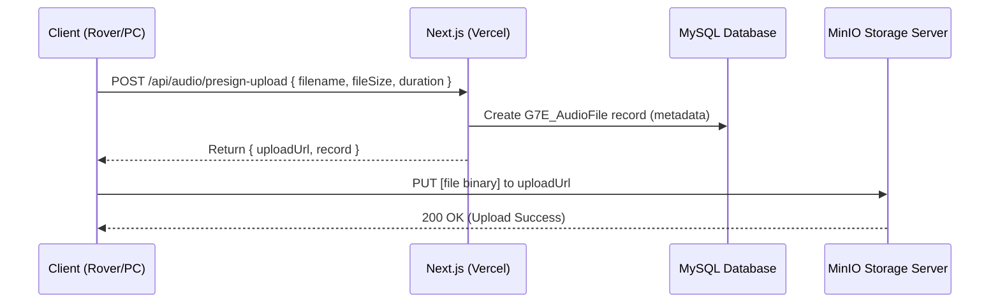

# MinIO Audio Streaming API Guide

This guide describes how to consume the `/api/audio/stream` API endpoint to stream audio files dynamically from your MinIO bucket.

---

## Endpoint Details

* **URL**: `/api/audio/stream`
* **Method**: `GET`
* **Auth**: Public (no session/header authentication required)

### Query Parameters

| Parameter | Type | Required | Description | Example |
| :--- | :--- | :--- | :--- | :--- |
| `bucket` | `string` | **Yes** | The MinIO bucket name. | `rover-audio` |
| `path` | `string` | **Yes** | The folder/file path inside the bucket. | `2026/06/19/audio_log.wav` |

---

## How it Works (Under the Hood)

1. The API endpoint retrieves the object metadata using `minioClient.statObject()` to set the proper `Content-Length` header.
2. It fetches the readable stream from MinIO using `minioClient.getObject()`.
3. It converts the Node.js readable stream to a Web standard `ReadableStream` using `Readable.toWeb(stream)`.
4. It pipes this stream directly back to the HTTP client chunk-by-chunk. This ensures that the audio file is **never fully loaded into memory**, eliminating OOM (Out Of Memory) errors on Vercel.

---

## Usage Examples

### 1. HTML5 Audio Player (Direct URL)

The easiest way to stream and play the audio is by passing the streaming URL directly into the `src` attribute of a standard HTML5 `<audio>` element:

```html
<audio controls>
  <source src="/api/audio/stream?bucket=rover-audio&path=2026/06/19/audio_log.wav" type="audio/wav">
  Your browser does not support the audio element.
</audio>
```

### 2. React / Next.js Component

To display an audio player in your frontend interface (e.g. Next.js Client Components):

```tsx
"use client";

import React from "react";

interface AudioPlayerProps {
  bucket: string;
  filePath: string;
}

export default function AudioPlayer({ bucket, filePath }: AudioPlayerProps) {
  const streamUrl = `/api/audio/stream?bucket=${encodeURIComponent(bucket)}&path=${encodeURIComponent(filePath)}`;

  return (
    <div className="p-4 border rounded-lg bg-gray-50 dark:bg-zinc-900 border-gray-200 dark:border-zinc-800">
      <h3 className="text-sm font-semibold mb-2 text-gray-700 dark:text-gray-200">
        Rover Audio Log
      </h3>
      <audio controls className="w-full">
        <source src={streamUrl} type="audio/wav" />
        Your browser does not support the audio element.
      </audio>
    </div>
  );
}
```

### 3. Fetching the Stream via JavaScript (Blob/Object URL)

If you need to fetch the file contents programmatically to download or modify it in JS:

```javascript
async function playAudioStream(bucket, path) {
  const url = `/api/audio/stream?bucket=${encodeURIComponent(bucket)}&path=${encodeURIComponent(path)}`;
  
  const response = await fetch(url);
  if (!response.ok) {
    throw new Error("Failed to stream audio file");
  }

  // Retrieve the response as a blob
  const blob = await response.blob();
  
  // Create a local URL pointing to the blob
  const audioUrl = URL.createObjectURL(blob);
  
  // Play using Javascript Audio API
  const audio = new Audio(audioUrl);
  audio.play();
}
```

### 4. Fetching via command line (cURL)

To save the streamed file to disk using curl:

```bash
curl -o downloaded_file.wav "https://joinproject.vercel.app/api/audio/stream?bucket=rover-audio&path=2026/06/19/audio_log.wav"
```

---

## Headers Returned

The response will contain the following HTTP headers:

* **`Content-Type`**: Dynamically guessed based on the file extension (e.g., `audio/wav`, `audio/mpeg`, etc.).
* **`Content-Length`**: Size of the file in bytes (retrieved from MinIO object stats).
* **`Accept-Ranges`**: `bytes` (enables audio players to seek to different parts of the audio track).
* **`Cache-Control`**: `private, max-age=3600` (caches stream chunks in client browser for 1 hour to save bandwidth).

---

## Large File Upload Guide (Bypassing Vercel 4.5 MB Limit)

Because Vercel Serverless Functions enforce a strict **4.5 MB request payload limit**, uploading files larger than 4.5 MB via `/api/audio/upload` returns a `413 FUNCTION_PAYLOAD_TOO_LARGE` error.

To upload large files, use the **Presigned Upload URL** workflow.

### Upload Workflow Diagram



### Step 1: Request the Presigned Upload URL

Send a `POST` request to `/api/audio/presign-upload` with file metadata.

#### Command (cURL):
```bash
curl -X POST https://joinproject.vercel.app/api/audio/presign-upload \
  -H "Content-Type: application/json" \
  -H "X-API-Key: rvr-G7E-a9f2c4d81b3e7056kX2mNpQw" \
  -d '{
    "filename": "audio_large.wav",
    "fileSize": 18500000,
    "duration": 180
  }'
```

#### JSON Response:
```json
{
  "success": true,
  "uploadUrl": "http://213.136.71.169:9000/rover-audio/2026/06/19/1718836888433_audio_large.wav?X-Amz-Algorithm=...",
  "record": {
    "id": 42,
    "filename": "audio_large.wav",
    "minioBucket": "rover-audio",
    "minioPath": "2026/06/19/1718836888433_audio_large.wav",
    "fileSize": 18500000,
    "duration": 180,
    "uploadedAt": "2026-06-19T02:45:00.000Z"
  }
}
```

### Step 2: Upload File Binary directly to MinIO

Submit a `PUT` request directly to the returned `uploadUrl` with the file's binary stream as the body.

#### Command (cURL):
Use `curl`'s `--upload-file` or `-T` parameter to send raw binary payload:

```bash
curl -X PUT -H "Content-Type: audio/wav" \
  --upload-file "C:\Users\HAMMA\Downloads\tyla-chanel-official-music-video-svaajm.wav" \
  "http://213.136.71.169:9000/rover-audio/2026/06/19/1718836888433_audio_large.wav?X-Amz-Algorithm=..."
```

*(Note: Replace the third parameter with your exact generated `uploadUrl` returned in Step 1. Ensure the URL is enclosed in double quotes.)*

---

### Frontend Upload Implementation (JavaScript)

```javascript
async function uploadLargeAudio(file, duration) {
  // Step 1: Get presigned URL
  const response = await fetch("/api/audio/presign-upload", {
    method: "POST",
    headers: {
      "Content-Type": "application/json",
      "X-API-Key": "rvr-G7E-a9f2c4d81b3e7056kX2mNpQw"
    },
    body: JSON.stringify({
      filename: file.name,
      fileSize: file.size,
      duration: duration
    })
  });

  const { uploadUrl, record } = await response.json();

  // Step 2: PUT directly to MinIO
  const uploadResponse = await fetch(uploadUrl, {
    method: "PUT",
    headers: {
      "Content-Type": file.type || "audio/wav"
    },
    body: file // Sends the raw File binary stream
  });

  if (uploadResponse.ok) {
    console.log("Upload successful! Database record:", record);
  } else {
    console.error("Upload failed.");
  }
}
```

